<div align="center">

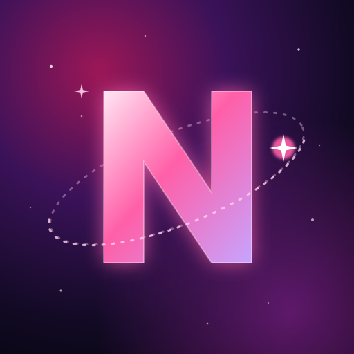

# Nova Notes

**A note editor that writes from the centre of the universe outwards.**

Google Docs–style writing in the Novacane cosmic look: centred by default, six colour themes, soft cosmic sounds, import from Word, HTML, Markdown and text, and send it all to Google Docs.


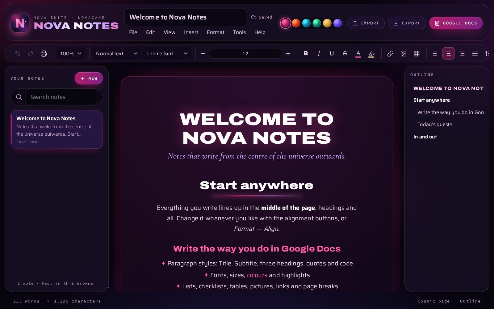

### ✦ [Open Nova Notes](https://nova-notes.novacane-studio.workers.dev) ✦

<sub>Works in any modern browser · install it as an app · works offline · also built into Nova Agent</sub>

</div>

---

## What's new

| | |
|---|---|
| 🔔 **Sound effects** | Soft cosmic sounds on every action. Switch them off or on in **View → Sound effects**. |
| 🔒 **All Nova suite links** | **Help → 🔒 All Nova suite links** opens the password-protected page with every Nova suite address, live and testing. |
| ✦ **Inside Nova Agent** | Nova Agent serves its own copy at `/notes/`, so privacy-minded browsers don't block it there. Notes written there are kept on the studio computer. |

## See it in action

<p align="center">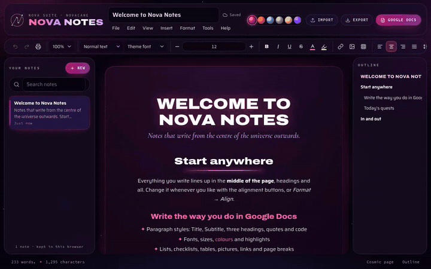 makes a quote, all centred on the page, then ticking a checklist item"></p>

<p align="center"><sub>Type <code>#</code>, <code>-</code>, <code>[]</code> or <code>&gt;</code> and a space at the start of a line. Everything lines up in the middle.</sub></p>

## What it does

**Writes like Google Docs**
- **Menus and a toolbar** you already know: File, Edit, View, Insert, Format, Tools and Help, with undo, redo, print, zoom, styles, fonts, sizes, colours and highlights.
- **Paragraph styles:** Title, Subtitle, Heading 1–3, Normal text, Quote and Code.
- **Lists:** bulleted, numbered and **checklists** you tick with a click; indent and outdent.
- **Tables** (pick a size, then add or remove rows and columns), **pictures** (upload, paste or drop, then resize and align), **links**, horizontal lines and **page breaks**.
- **Find and replace** (match case, whole words), **word count**, a live **outline** of your headings, and **undo that remembers everything**, including the tools the browser forgets.
- **Shortcuts as you type:** `#` heading, `-` list, `1.` numbered list, `[]` checklist, `>` quote and `---` for a line. Every Google Docs keyboard shortcut you'd expect is there too (press <kbd>Ctrl</kbd>+<kbd>/</kbd>).

**Centred by default.** Everything you write (headings, paragraphs, lists and tables) sits in the middle of the page until you choose otherwise. Exports keep it that way.

**In and out**
- **Import** Word (`.docx`), web pages (`.html`), Markdown (`.md`) and text (`.txt`): use *File → Import* or drop files onto the window. Text pasted from Google Docs or the web is cleaned up as it lands.
- **Export** to Google Docs, Word (`.doc`), a web page, Markdown, plain text or PDF (print), or a `.json` backup of one note or all of them.
- **Google Docs**, two ways:
  1. **Copy & paste (no set-up):** copies the note with its styling and opens a new Google Doc; press <kbd>Ctrl</kbd>+<kbd>V</kbd>.
  2. **Save to Google Drive (one click once set up):** signs in with Google, creates a real Google Doc, and updates that same Doc each time you save the note again.

**Looks and sounds the part**
- **Six themes** from the Nova suite: Novacane (magenta), Solar Flare (red-orange), Pulsar (cyan), Aurora (green and violet), Eclipse (gold) and Quasar (ultraviolet).
- **Two page styles:** *Cosmic* (a glowing glass page among twinkling stars) and *Paper* (white, exactly how the note exports and prints).
- **Sound effects:** gentle bells and sparkles as you work (see below).
- **Focus mode,** a pageless view, zoom, and a layout that works on phones and tablets.

**Private by default.** Notes are saved in your browser (IndexedDB) as you type. Nothing leaves it unless you export it or send it to Google Docs.

## Screenshots

| | |
|---|---|
| 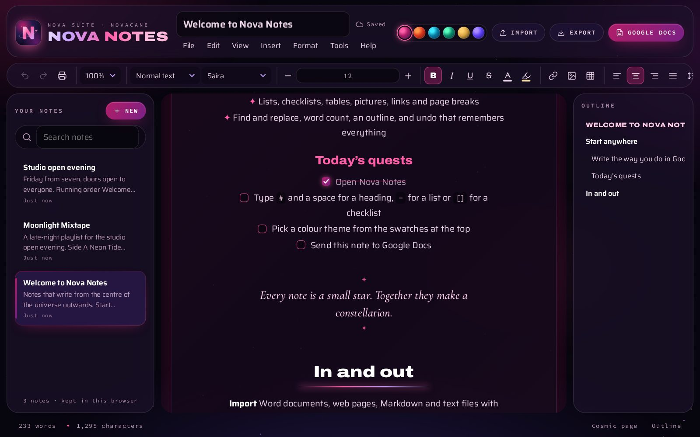 | 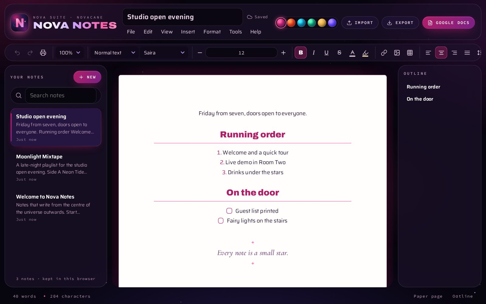 |
| **Checklists, lists and quotes**, all centred | **Paper page:** what Google Docs, Word and print will show |
| 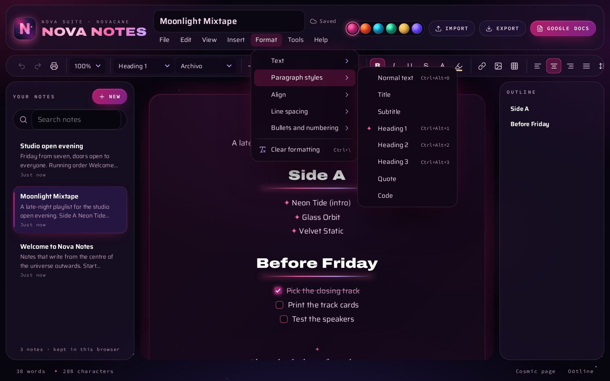 | 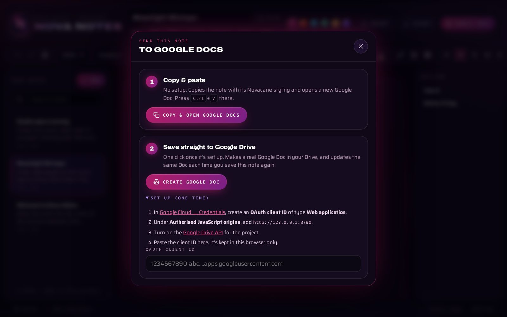 |
| **Google Docs–style menus** with shortcuts | **Send to Google Docs:** copy and paste, or save straight to Drive |
| 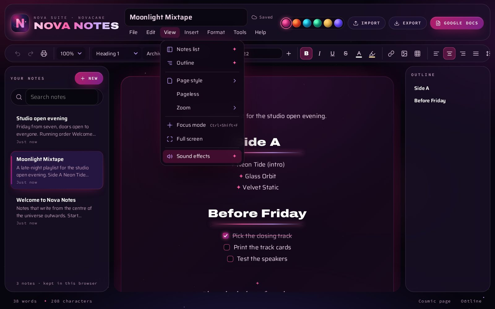 | 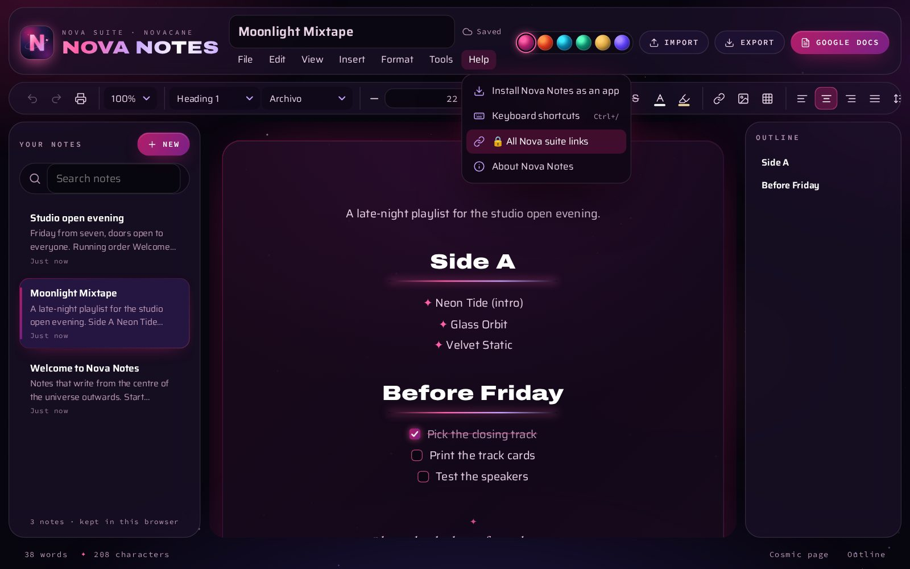 |
| **View → Sound effects**, ticked while sounds are on | **Help → 🔒 All Nova suite links** |

<details>
<summary><b>Every colour theme, and a phone</b></summary>

| | |
|---|---|
| 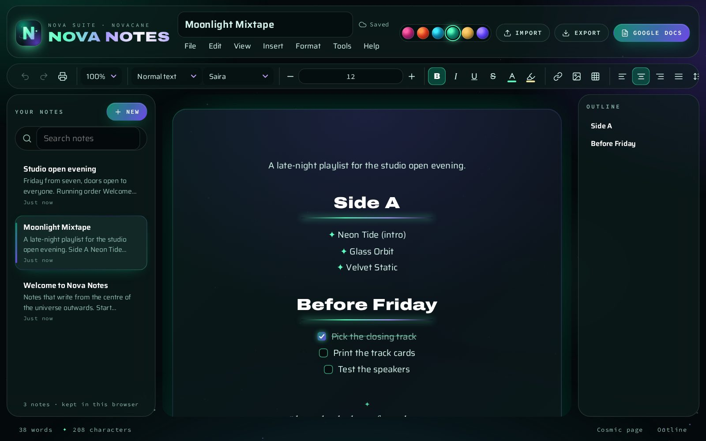 | 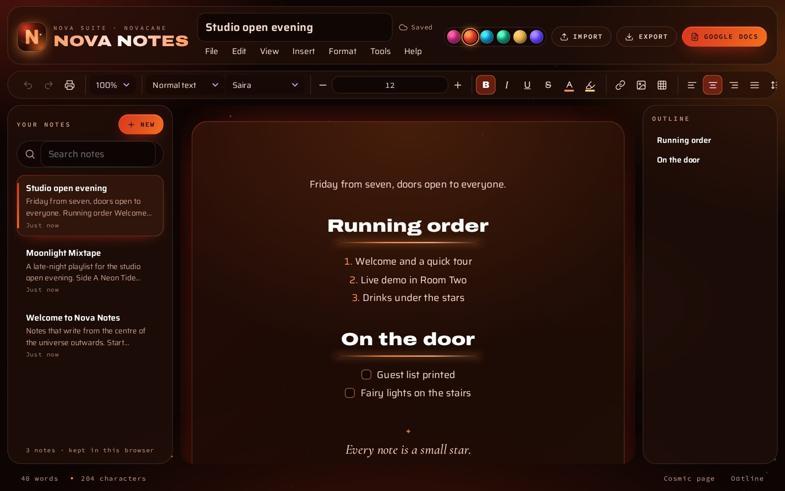 |
| Aurora | Solar Flare |
| 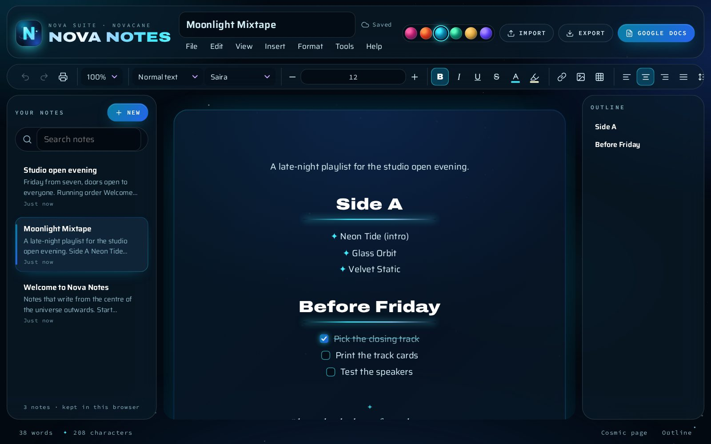 | 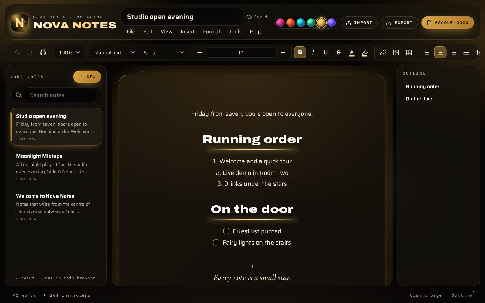 |
| Pulsar | Eclipse |
| 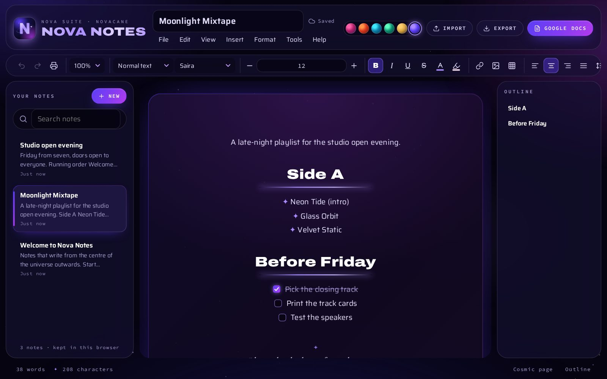 | 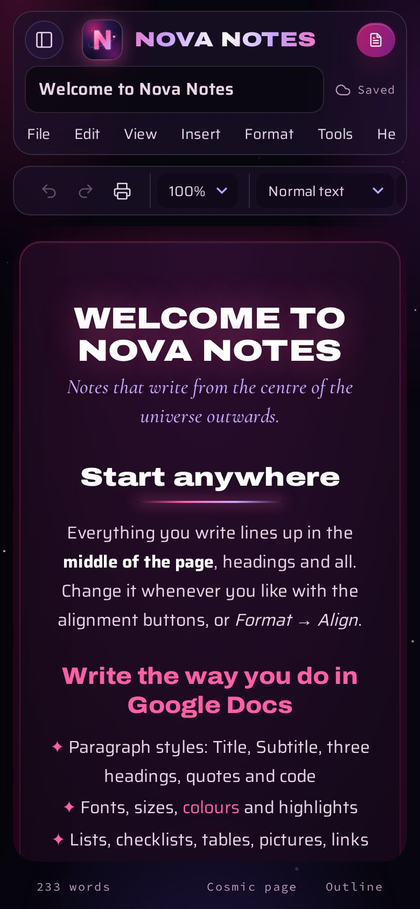 |
| Quasar | On a phone |

</details>

<sub>Every screenshot uses a fresh browser with the built-in welcome note and a couple of made-up notes.</sub>

## Sound effects

Every press makes a soft cosmic sound: a tap, a menu opening, a dialog closing, an export sending, a note deleting. They're made live in the browser with the Web Audio API (there are no sound files), tuned to one pentatonic scale so they sound like one family, and kept quiet.

- **On or off:** *View → Sound effects*. It's ticked while they're on, and plays a little chime when you switch.
- **Remembered** on each device.
- **Shared:** the same `js/sfx.js` makes the sounds in Nova Calendar and Nova Observatory too.

## Inside Nova Agent

[Nova Agent](https://github.com/tuniveza/nova-agent), the studio computer's helper, serves its own copy of Nova Notes at **`/notes/`** (for example `http://localhost:4545/notes/`) whenever it's running.

| | On the web | Inside Nova Agent |
|---|---|---|
| Address | nova-notes.novacane-studio.workers.dev | `/notes/` on Nova Agent |
| Where notes are kept | In that browser | On the studio computer, separate from the web app's |
| Privacy-minded browsers | May limit what a website saves | Fine: it's part of Nova Agent |

## Use it as an app

Open **https://nova-notes.novacane-studio.workers.dev** and install it:

- **Computer (Chrome, Edge):** the **Install** button in the top bar, the install icon in the address bar, or *Help → Install Nova Notes as an app*.
- **Android:** browser menu → **Install app** / **Add to Home screen**.
- **iPhone / iPad:** Safari → **Share** → **Add to Home Screen**.

Once installed it has its own icon and window, works offline, and can:
- start a **new note** straight from the icon's shortcut menu (long-press or right-click the icon),
- take things you **share** from other apps on your phone (text and links become a new note),
- **open `.md`, `.txt`, `.html` and `.docx` files** directly (on computers: *Open with → Nova Notes*).

Notes stay on each device. To move them between devices, use *File → Back up all notes* and *Restore a backup*, or send them to Google Docs.

## Run it yourself

It's a static web app: no install and no build step.

```sh
cd nn
python3 -m http.server 4610
# open http://localhost:4610
```

To publish your own copy on Cloudflare: `npx wrangler deploy` (see `wrangler.jsonc`; `_headers` sets the security headers and `.assetsignore` keeps the README and media out of the site).

Opening `index.html` straight from disk works too, except for *Save to Google Drive*: Google sign-in needs a web address (`http://` or `https://`). Fonts come from Google Fonts, and Word import loads [mammoth](https://github.com/mwilliamson/mammoth.js) from cdnjs the first time it's used.

### Setting up "Save to Google Drive" (optional, one time)

1. In [Google Cloud → Credentials](https://console.cloud.google.com/apis/credentials), create an **OAuth client ID** of type **Web application**.
2. Add the address you open Nova Notes from (e.g. `http://localhost:4610`) under **Authorised JavaScript origins**.
3. Enable the [Google Drive API](https://console.cloud.google.com/apis/library/drive.googleapis.com) for the project.
4. In Nova Notes, open **Google Docs → Set up** and paste the client ID. It's stored in that browser only.

Nova Notes asks only for the `drive.file` permission, which covers files the app itself creates and nothing else in your Drive.

## How it works

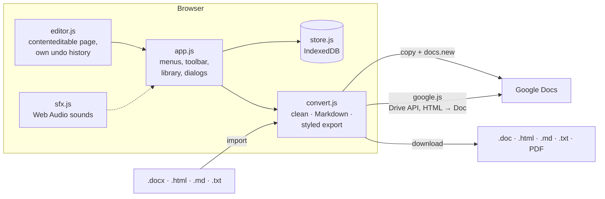

- **`editor.js`**: the writing surface. It handles commands and paragraph styles, lists and checklists, tables, pictures, find and replace, and Markdown-style shortcuts. Undo works from snapshots of the page and selection, so every change can be undone.
- **`convert.js`**: cleans pasted and imported HTML down to what the editor understands, converts Markdown both ways, and builds the **styled export**: every block is inline-styled in the current theme's colours, made deep enough to read on white, so Google Docs and Word keep the look and the centring.
- **`google.js`**: the clipboard route (rich HTML plus plain text) and the Drive route (Google Identity Services token → multipart upload that Drive converts to a Google Doc, then `PATCH` to update it).
- **`store.js`**: notes in IndexedDB (falling back to localStorage), settings, backup and restore.
- **`sfx.js`**: the Nova suite's sound effects. One listener works out what kind of thing was pressed and plays the matching sound; an element can choose its own with `data-sfx`.
- **`themes.js`** and **`backdrop.js`**: the Nova suite's colour themes and the star field, shared with [Nova Calendar](https://github.com/tuniveza/nova-calendar).

## Keyboard shortcuts

| | |
|---|---|
| Bold / italic / underline | <kbd>Ctrl</kbd> <kbd>B</kbd> / <kbd>I</kbd> / <kbd>U</kbd> |
| Strikethrough | <kbd>Alt</kbd> <kbd>Shift</kbd> <kbd>5</kbd> |
| Normal text / Heading 1–3 | <kbd>Ctrl</kbd> <kbd>Alt</kbd> <kbd>0</kbd>–<kbd>3</kbd> |
| Left / centre / right / justify | <kbd>Ctrl</kbd> <kbd>Shift</kbd> <kbd>L</kbd> / <kbd>E</kbd> / <kbd>R</kbd> / <kbd>J</kbd> |
| Numbered / bulleted / checklist | <kbd>Ctrl</kbd> <kbd>Shift</kbd> <kbd>7</kbd> / <kbd>8</kbd> / <kbd>9</kbd> |
| Link | <kbd>Ctrl</kbd> <kbd>K</kbd> |
| Find and replace | <kbd>Ctrl</kbd> <kbd>H</kbd> |
| Word count | <kbd>Ctrl</kbd> <kbd>Shift</kbd> <kbd>C</kbd> |
| Page break | <kbd>Ctrl</kbd> <kbd>Enter</kbd> |
| New note · Import · Print | <kbd>Ctrl</kbd> <kbd>Alt</kbd> <kbd>N</kbd> · <kbd>Ctrl</kbd> <kbd>O</kbd> · <kbd>Ctrl</kbd> <kbd>P</kbd> |
| Focus mode | <kbd>Ctrl</kbd> <kbd>Shift</kbd> <kbd>F</kbd> |
| Every shortcut | <kbd>Ctrl</kbd> <kbd>/</kbd> |

## Project layout

```
nn/
├── index.html          the app: top bar, menus, toolbar, page, panels, dialogs, icon sprite
├── manifest.webmanifest  install details: name, icons, shortcuts, sharing, file opening
├── sw.js               offline support (caches the app, fonts and the Word importer)
├── _headers            security headers for the hosted site
├── wrangler.jsonc      Cloudflare hosting (static assets only)
├── css/nova-notes.css  all the styling: cosmic and paper pages, themes, print, phones
├── js/
│   ├── sfx.js          the Nova suite sound effects (shared with Nova Calendar and Nova Observatory)
│   ├── themes.js       colour themes (shared with Nova Calendar)
│   ├── backdrop.js     the twinkling star field
│   ├── store.js        IndexedDB notes, settings, backup/restore
│   ├── convert.js      cleaning, Markdown, styled export for Google Docs / Word / HTML
│   ├── google.js       copy-and-paste and Drive routes to Google Docs
│   ├── editor.js       the rich text editor
│   └── app.js          everything around the page
├── assets/             the app icon (icon.svg and PNG sizes), Nova sigil, install screenshots
└── docs/media/         README screenshots and demo
```

## Part of the Nova suite

| | |
|---|---|
| [**nova-suite**](https://github.com/tuniveza/nova-suite) | The whole suite in one place |
| [**nova-bot**](https://github.com/tuniveza/nova-bot) | The studio's chat assistant, bookings and staff app back end |
| [**nova-agent**](https://github.com/tuniveza/nova-agent) | The studio computer's helper; also serves Nova Notes, Nova Calendar and Nova Observatory |
| [**nova-club**](https://github.com/tuniveza/nova-club) | The members' Android app |
| [**nova-calendar**](https://github.com/tuniveza/nova-calendar) | A cosmic calendar of note cards and day cards |
| [**nova-notes**](https://github.com/tuniveza/nova-notes) | You are here |
| [**nova-observatory**](https://github.com/tuniveza/nova-observatory) | A dashboard of every project |
| [**nova-index**](https://github.com/tuniveza/nova-index) | The suite's shared memory |

---

<p align="center"><sub>Made for <b>Novacane Studios</b> · All rights reserved</sub></p>
